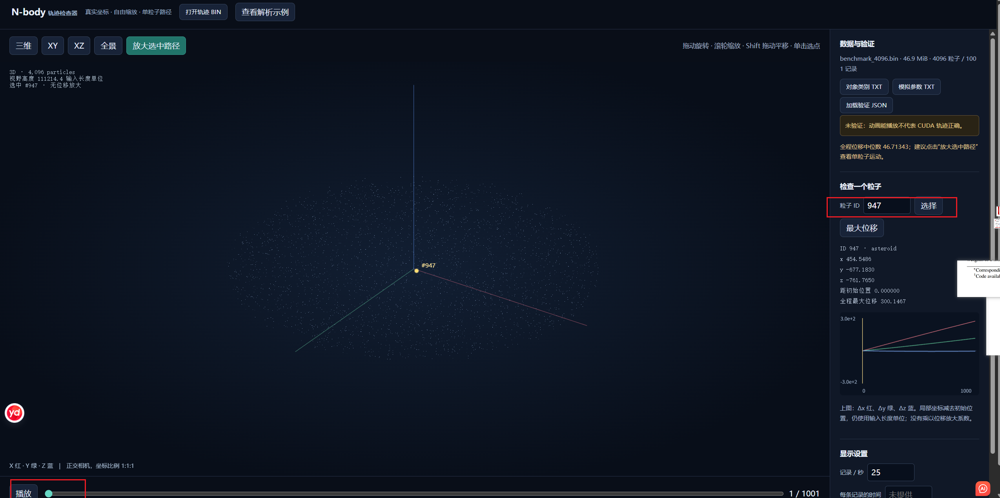

# N 体引力模拟与可视化

## 简介

你是“巡天”深空探测项目的核心算法工程师，负责模拟小行星带、卫星碎片和探测器之间的引力相互作用，以辅助航迹规划和碰撞风险评估。地面控制中心每天需要评估大量不同初始条件下的演化结果，传统 CPU 程序在粒子数量上升后很快无法满足交互式分析需求。

你的任务是开发一个 GPU 加速的 N 体引力模拟器，能够并行计算数千到数十万个天体之间的相互作用，并输出轨迹数据供 Python 可视化。最终，你需要提供一个可以展示星团演化、轨道扰动和局部碰撞风险的动画脚本，帮助工程团队直观理解模拟结果。

## 任务内容

开发 CUDA 程序模拟 N 体引力系统，并输出轨迹点供 Python 可视化。

# N 体引力模拟器（CUDA）

## 实现与文件

- `nbody.cu`：共享内存分块的直接 O(N²) 引力计算，支持半隐式 Euler 和 Leapfrog。
- `visualize.py`：NumPy 内存映射读取 BIN，提供统一 CLI，所有模式使用 Matplotlib `FuncAnimation`。
- `raster_animation.py`：CUDA/NumPy 投影和密度图生成，Matplotlib 绘制图像及固定粒子 ID 的连续尾迹。
- `data/generate_cases.py`：原有双体、星团、太阳系、银河盘尺度 benchmark 的确定性生成器。
- `data/generate_orbit_demo.py`：独立归一化轨道演示，不改写现有 benchmark。
- `test_visualization.py`：读取、帧选择、渲染计算、CUDA 对照与动画导出回归。
- `test_a800_visualization.sh`：复用已有 BIN 进行 A800/CPU 对比，输出日志、视频及截图。

## 编译、模拟与动画

以下在 Linux 的 `08_nbody` 目录执行，使用的是4090的GPU，编译参数使用`-arch=sm_89`

### 环境配置

```bash
# 首先安装pip依赖包
pip install -r requirements
```

```bash
# 安装ffmpeg
# 下载预编译包
curl -fL --retry 3 --connect-timeout 20 \
    https://johnvansickle.com/ffmpeg/releases/ffmpeg-release-amd64-static.tar.xz \
    -o "$HOME/.local/opt/nbody-ffmpeg/ffmpeg.tar.xz"
# 下载成功后解压
tar -xJf "$HOME/.local/opt/nbody-ffmpeg/ffmpeg.tar.xz" \
    -C "$HOME/.local/opt/nbody-ffmpeg" \
    --strip-components=1
# 让当前终端和 Python 找到这两个程序
export PATH="$HOME/.local/opt/nbody-ffmpeg:$PATH"
# 验证ffmpeg软件
ffmpeg -version
ffprobe -version
```

```bash
# 编译cuda文件 （4090硬件）
nvcc -O3 -std=c++17 -lineinfo -arch=sm_89 nbody.cu -o nbody
```

### 验证4096粒子

```bash
# 生成4096粒子的随机信息
python3 data/generate_cases.py --case benchmark_4096 \
--output-dir data/
# 生成4096粒子的运动轨迹和日志
./nbody \
data/benchmark_4096_particles.txt \
data/benchmark_4096_params.txt \
results/benchmark_4096.bin \
results/benchmark_4096.performance.log
# 验证4096粒子运动符合规律
python3 verify_trajectory.py results/benchmark_4096.bin --particles data/benchmark_4096_particles.txt --params data/benchmark_4096_params.txt  --sample-particles 16 --report results/verified_4096/benchmark_4096.validation.json
# 生成4096粒子动画
python3 visualize.py results/benchmark_4096.bin \
    --objects data/benchmark_4096_objects.txt \
    --backend gpu --dimension 3d --layout detail \
    --fps 25 --trail 160 --trail-particles 32 --z-scale 1 \
    --record-dt .01 --time-unit Myr --video-encoder cpu \
    --output results/verified_4096/benchmark_4096_detail.mp4
```

### 验证65536粒子

```bash
# 生成65536粒子的随机信息
python3 data/generate_cases.py --case benchmark_65536 --output-dir data

# 生成65536粒子的运动轨迹和日志
./nbody \
    data/benchmark_65536_particles.txt \
    data/benchmark_65536_params.txt \
    results/benchmark_65536.bin \
    results/benchmark_65536.performance.log

# 验证65536粒子运动符合规律
python3 verify_trajectory.py \
    results/benchmark_65536.bin \
    --particles data/benchmark_65536_particles.txt \
    --params data/benchmark_65536_params.txt \
    --sample-particles 16 \
    --report results/verified_65536/benchmark_65536.validation.json

# 生成65536粒子动画
python3 visualize.py results/benchmark_65536.bin \
    --objects data/benchmark_65536_objects.txt \
    --backend gpu --dimension 3d --layout detail \
    --fps 25 --trail 160 --trail-particles 32 --z-scale 1 \
    --record-dt .01 --time-unit Myr --video-encoder cpu \
    --output results/verified_65536/benchmark_4096_detail.mp4
```

## 单粒子可视化

由于生成的`4096`粒子和`65536`粒子在生成的mp4动画中难以观察到粒子的细致变换，因此，开发了`trajectory_viewer.html`这个可视化的页面，通过导入`4096`粒子和`65536`粒子的二进制的bin文件，即可逐个粒子的观察运动轨迹。

如图所示：


导入轨迹bin文件后，可以选择某个编号儿的粒子，例如这里选择了976这个编号的粒子，可以放大选中路径，然后点击播放，观看粒子的运动轨迹。

## 显卡适配

由于本项目主要利用cuda并行编程对粒子进行模型，因此需要进行平台适配的是`nbody.cu`文件

- 在`nbody.maca`文件中完成对沐曦平台的粒子模拟代码适配；


